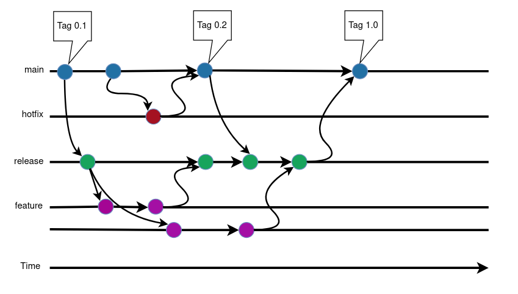

# drone-PYlot
MTRX5700 Major Project

luke is a poopy head

Daniel this isn't very nice of you. I'm telling your mum


[](https://github.com/liv-cpz/slam_traffic/actions/workflows/ci_actions.yml) [](https://github.com/pylint-dev/pylint)

## Arduino BLE

### Dependencies

```
sudo apt-get install python3-pip libglib2.0-dev
sudo pip3 install bluepy
curl -fsSL -o get-platformio.py https://raw.githubusercontent.com/platformio/platformio-core-installer/master/get-platformio.py
python3 get-platformio.py
```

### Usage

Arduino
```
cd ~/ros2_ws/src/drone-PYlot/src/IMU
platformio run --target upload
```

BLE Receiver
```
cd ~/ros2_ws/src/drone-PYlot/src
sudo python3 IMU_receiver.py
```

## UGV02
Linux
```
sudo chmod 666 <port>
cd ~/ros2_ws/src/drone-PYlot/src/UGV
python3 UGV.py
```


## General Project Structure
```
your_ros_workspace_folder/
    install/
    log/
    build/
    src/
        <this_ros_package>/
            README.md
            .gitignore
            package.xml
            resource/
                <this_ros_package>
            setup.cfg
            setup.py
            <this_ros_package>/
                __init__.py
                <your_node>.py
            test/
                test_<your_node>.py
            launch/
                <your_launch_file>.launch.py
            docs/
            <other_folders>
        <other_ros_packages>
        ...
```


### Source ROS 2
```shell
source /opt/ros/humble/setup.bash
```


### ROS Development Workspace
```shell
mkdir -p ~/ros2_ws/src
cd ~/ros2_ws/src
```


### Clone repo
Linux
```shell
cd ~/ros2_ws/src
git clone <repo>
cd ../..
rosdep install -i --from-path src --rosdistro humble -y
colcon build
```


### Run

#### ros2 run
Linux
```shell
ros2 run <package_name> <node_executable_name>
```

#### ros2 launch
Linux
```shell
ros2 launch <package_name> <launch_file_name.py>
```


### Python Packages
```
my_package/
      package.xml
      resource/my_package
      setup.cfg
      setup.py
      my_package/
```
- `package.xml` - meta information aabout the package
- `resource/<package_name>` - marker file for package
- `setup.cfg` - required when package has executables e.g. so `ros2 run` can find them
- `setup.py` contians instructions for how to install the package
- `<package_name>` - directory with the same name as package used by ROS2 to find package, contains `__init__.py`


### Build

Linux
```shell
colcon build
#build select packages
colcon build --packages-select my_package
```


### Source setup file
Linux
```shell
source install/local_setup.bash
```


### Test

Linux
```shell
# Test select packages
colcon test --packages-select my_package
# See results
colcon test-result --all --verbose
```


### Linting
```shell
python3 -m pip install black
# Lint select packages
python3 -m black <files>
```


### package.xml

```xml
<?xml version="1.0"?>
<?xml-model
   href="http://download.ros.org/schema/package_format3.xsd"
   schematypens="http://www.w3.org/2001/XMLSchema"?>
<package format="3">
 <name>my_package</name>
 <version>0.0.0</version>
 <description>TODO: Package description</description>
 <maintainer email="user@todo.todo">user</maintainer>
 <license>TODO: License declaration</license>

 <test_depend>ament_copyright</test_depend>
 <test_depend>ament_flake8</test_depend>
 <test_depend>ament_pep257</test_depend>
 <test_depend>python3-pytest</test_depend>

 <export>
   <build_type>ament_python</build_type>
 </export>
</package>
```


### setup.py

```python
from setuptools import setup

package_name = 'my_py_pkg'

setup(
 name=package_name,
 version='0.0.0',
 packages=[package_name],
 data_files=[
     ('share/ament_index/resource_index/packages',
             ['resource/' + package_name]),
     ('share/' + package_name, ['package.xml']),
   ],
 install_requires=['setuptools'],
 zip_safe=True,
 maintainer='TODO',
 maintainer_email='TODO',
 description='TODO: Package description',
 license='TODO: License declaration',
 tests_require=['pytest'],
 entry_points={
     'console_scripts': [
             'my_node = my_py_pkg.my_node:main'
     ],
   },
)
```


## GitHub Flow

- `main` Branch where all merge requests go
- `hotfix` (could also call `patch`) - branches for minor edits and fixes
- `release` stable releases of code pushed to - should be tagged with a version number to differeniate
- `feature` branches used in most cases when adding a substantial amount of code or implementing a specific new feature to the code base


### Git Pre-Commit Hooks
```shell
python3 -m pip install pre-commit
cd <your_ros_workspace_folder>/src/slam_traffic
pre-commit install --install-hooks
```

- [Pre-commit](https://pre-commit.com/) is a framework for managing and maintaining multi-language pre-commit hooks. It allows you to automatically run linters, formatters, and other tools on your code before committing it to the repository.
- Pre-commit hooks include:
    - automatic linting to make code flake8 compliant
    - removes trailing whitespace
    - checks for merge conflicts
    - checks for symlinks that are broken or not allocated
    - checks for files that are too large for git


### Branching
Make a new branch
```shell
git checkout -b <new-branch-name>
```
Follow naming convention `<type>/<branch-name>` e.g. `feature/calibrate-arm`


### Tagging
Pin & identify specific versions of the code. [Git Tagging](https://git-scm.com/book/en/v2/Git-Basics-Tagging). General rule of tagging for version specification: `v<major-version-no>.<minor-version-no>`


